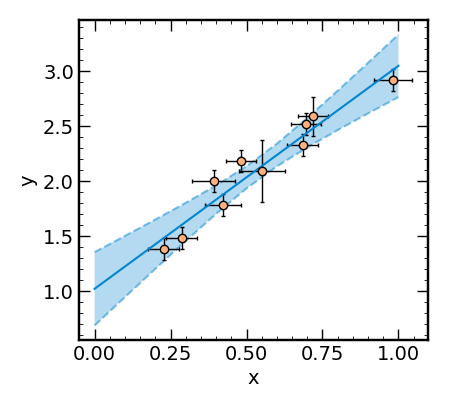

# LinRegConf
Perform linear least squares regression, accounting for uncertainty, using linear algebra methods to minimize the objective function
(in this case, $\chi^2$).

When using this code, please cite this repository using the reference provided here by GitHub.

## Example
``` python
import numpy as np
from LinRegConf import LinRegConf
# make fake data
np.random.seed(123)
n = 10
x_data = np.random.rand(n)
y_data = 2*x_data+1 + np.random.randn(n)*0.1
x_errs = np.max([abs(np.random.randn(n)*0.05),np.zeros(n)+0.05],axis=0)
y_errs = np.max([abs(np.random.randn(n)*0.1),np.zeros(n)+0.1],axis=0)
# fit plus confidence intervals (supports any polynomial order)
# automatically incorportates y errors if given
# for now, x errors are only for plotting
fit = LinRegConf(x_data,y_data,x_err=x_errs,y_err=y_errs,n_poly=1,p=0.05)
# print best-fit parameters
fit.pprint()
# plot fit plus data
fit.plot()
```
```
a_0 x^0  :  1.023 +/- 0.109
a_1 x^1  :  2.025 +/- 0.188
```


## Licensing
<a href="https://github.com/sflury/LinRegConf">LinRegConf</a> © 2023-2025 by <a href="https://sflury.github.io">Sophia Flury</a> is licensed under <a href="https://creativecommons.org/licenses/by-nc-nd/4.0/">Creative Commons Attribution-NonCommercial-NoDerivatives 4.0 International</a>


This license enables reusers to copy and distribute LinRegConf in any medium or format in unadapted form only, for noncommercial purposes only, and only so long as attribution is given to the creator. CC BY-NC-ND 4.0 includes the following elements:

BY: credit must be given to the creator.
NC: Only noncommercial uses of the work are permitted.
ND: No derivatives or adaptations of the work are permitted.

You should have received a copy of the CC BY-NC-ND 4.0 along with this program. If not, see <https://creativecommons.org/licenses/by-nc-nd/4.0/>.
